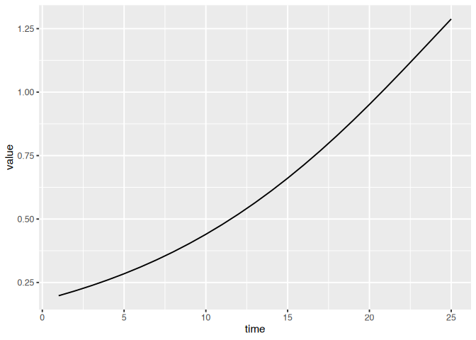
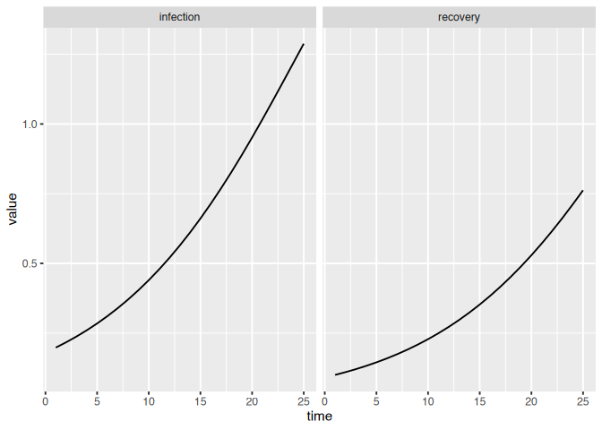
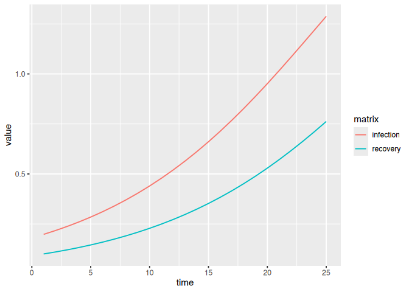

Exploration Exercises
================

## `ggplot` Recipes

Simulations from `macpan2` come in a standard format with columns
described
[here](https://canmod.github.io/macpan2/articles/quickstart.html#generating-simulations),
and full documentation
[here](https://canmod.github.io/macpan2/reference/mp_trajectory.html#value).
The key point is that there is always a `time`, `matrix`, and `value`
column. Let’s focus on those. We can use this SIR example.

``` r
library(macpan2); library(ggplot2)
```

    ## 
    ## Attaching package: 'ggplot2'

    ## The following object is masked _by_ '.GlobalEnv':
    ## 
    ##     theme_bw

``` r
sir = mp_tmb_library("starter_models", "sir", package = "macpan2")
sim = mp_simulator(sir, time_steps = 25, outputs = "infection")
dat = mp_trajectory(sim)
print(dat)
```

    ##       matrix time row col     value
    ## 1  infection    1   0   0 0.1980000
    ## 2  infection    2   0   0 0.2169692
    ## 3  infection    3   0   0 0.2376233
    ## 4  infection    4   0   0 0.2600847
    ## 5  infection    5   0   0 0.2844793
    ## 6  infection    6   0   0 0.3109346
    ## 7  infection    7   0   0 0.3395786
    ## 8  infection    8   0   0 0.3705380
    ## 9  infection    9   0   0 0.4039349
    ## 10 infection   10   0   0 0.4398849
    ## 11 infection   11   0   0 0.4784928
    ## 12 infection   12   0   0 0.5198490
    ## 13 infection   13   0   0 0.5640248
    ## 14 infection   14   0   0 0.6110669
    ## 15 infection   15   0   0 0.6609922
    ## 16 infection   16   0   0 0.7137807
    ## 17 infection   17   0   0 0.7693697
    ## 18 infection   18   0   0 0.8276464
    ## 19 infection   19   0   0 0.8884416
    ## 20 infection   20   0   0 0.9515225
    ## 21 infection   21   0   0 1.0165878
    ## 22 infection   22   0   0 1.0832626
    ## 23 infection   23   0   0 1.1510954
    ## 24 infection   24   0   0 1.2195575
    ## 25 infection   25   0   0 1.2880447

If we are simulating a single variable, the `matrix` column will be
constant and so we will use recipes like this.

``` r
(dat
  |> ggplot()
  + geom_line(aes(time, value))
)
```

<!-- -->

If we have multiple variables we can use the `matrix` column in our
visualizations to keep track of different variables.

``` r
sim = mp_simulator(sir, time_steps = 25, outputs = mp_flow_vars(sir))
dat = mp_trajectory(sim)
(dat
  |> ggplot()
  + geom_line(aes(time, value))
  + facet_wrap(~matrix)
)
```

<!-- -->

``` r
(dat
  |> ggplot()
  + geom_line(aes(time, value, colour = matrix))
)
```

<!-- -->

## Functional Forms of Flow Rates

We have so far focused on specifying flows with either constant
per-capita rates or mass-action rates. There are a variety of
[mathematical
functions](https://canmod.github.io/macpan2/reference/engine_functions)
that you can use to build more complex functional forms for these rates.

|                                                                                                                                                                                                           |
|:-------------------------------------------------------------------------------------------------------------------------------------------------------------------------------------------------------------------------------------------------------|
| Building a simple model with seasonal cycles in transmission. What are some other forms of complexity in the functional forms of rates? Try to implement them. Keep in mind that you can use tilde-based expressions to define intermediate variables. |

## Unbalanced Flows

So far we have used the
[mp_per_capita_flow](https://canmod.github.io/macpan2/reference/mp_per_capita_flow)
function that specifies perfectly balanced flows – the total number out
of the `from` box is equal to the total number into the `to` box. But
processes like birth/death and importation do not behave this way – for
example, birth adds individuals to the `to` box without removing
individuals from the `from` box. Viral shedding into wastewater is
another process that is not a balanced flow. The above linked help page
describes two other kinds of flows that are not balanced.

|                                                                                                                                                                                      |
|:----------------------------------------------------------------------------------------------------------------------------------------------------------------------------------------------------------------------------------|
| Modify one of your models to include birth and death. Allow for the possibility of more birth than death. If your model uses a constant total population size, `N`, you will need to add expressions that update `N` dynamically. |

|       |
|:---------------------------------------------------|
| Add a wastewater compartment to an existing model. |

## Initializing Variables

So far we have initialized variables by adding numerical values to the
`default` list.

## Relationships Parameters and Simulations
